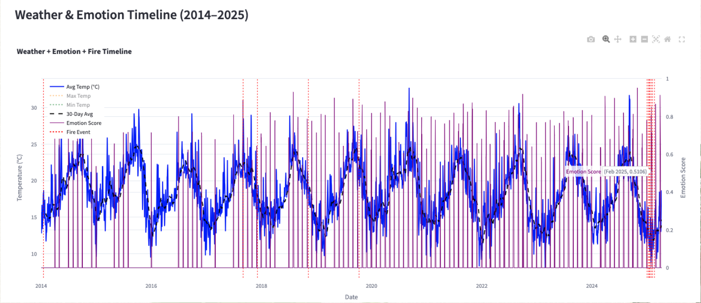

# LA Wildfire Prediction

Wildfire risk prediction for Los Angeles using 10 years of daily weather data and sentiment analysis of Los Angeles Times articles. A 5-phase pipeline combining time series weather data, web scraping, NLP, and machine learning: visualized through an interactive Streamlit dashboard.

---

## What This Project Does

Most wildfire prediction models rely on weather data alone. This project tests whether public media sentiment: specifically, the emotional tone of LA Times wildfire coverage, carries additional signal for predicting fire risk.

The pipeline pulls 10 years of daily weather observations from the Meteostat API, scrapes a decade of LA Times wildfire articles using an authenticated session, runs sentiment and emotion classification through HuggingFace Transformers, and trains three classifiers on the combined dataset. Results are visualized in an interactive Streamlit dashboard overlaying temperature trends, emotion scores, and historical fire events on a single timeline.

---

## Dashboard Preview



*Weather + Emotion + Fire Timeline (2014–2025) — temperature trends overlaid with emotion scores and fire event markers*

---

## Pipeline Overview

| Phase | Description | Tools |
|-------|-------------|-------|
| 1 | Weather data collection and cleaning | Meteostat API, pandas |
| 2 | LA Times article scraping | BeautifulSoup, requests, authenticated cookies |
| 3 | Sentiment and emotion analysis | HuggingFace Transformers (BERT, BART) |
| 4 | Model training and evaluation | scikit-learn, XGBoost, SMOTE |
| 5 | Interactive dashboard | Streamlit, Plotly |

---

## Phase 1 — Weather Data

Daily weather observations for Los Angeles (34.0522°N, 118.2437°W) collected via the Meteostat API covering January 1, 2014 to April 8, 2025.

**Cleaning steps:**
- Dropped sparse columns (snow, wind gust peak, sunshine duration)
- Forward-filled pressure gaps
- Forward and backward filled wind direction gaps

**Final features:** `date`, `temp_avg`, `temp_min`, `temp_max`, `precipitation`, `wdir`, `wind_speed`, `pressure`

---

## Phase 2 — Article Scraping

Scraped 10 years of LA Times wildfire articles using BeautifulSoup and an authenticated subscriber session. The scraper traversed monthly sitemaps from 2014 through April 2025, filtering articles by title and content keywords (`wildfire`, `forest fire`, `bushfire`, `los angeles`) with a 1-second delay between requests.

Output: `latimes_fire_articles.csv`, `latimes_fire_articles_cleaned.csv`

---

## Phase 3 — Sentiment and Emotion Analysis

Two HuggingFace models applied to filtered article content:

**Sentiment scoring** — `nlptown/bert-base-multilingual-uncased-sentiment`
- Star rating mapped to a continuous score: -1.0 (1 star) to +1.0 (5 stars)
- Applied to the first 512 tokens of each article

**Emotion classification** — `facebook/bart-large-mnli` (zero-shot classification)
- Labels: `fear`, `anger`, `alert`, `sadness`, `neutral`
- Confidence threshold: 0.7 (below threshold defaults to `neutral`)
- Adjusted emotion labels mapped to: `urgency`, `concern`, `neutral`

Output: `latimes_fire_articles_emotions_adjusted.csv`

---

## Phase 4 — Model Development

Weather features and emotion scores merged into a single daily dataset. Fire occurrence labels applied based on historical fire event dates.

**Feature set (8 features):**
`temp_avg`, `temp_min`, `temp_max`, `precipitation`, `wind_speed`, `pressure`, `emotion_encoded`, `emotion_score`

**Class imbalance:** Only 14 fire days in ~4,000 days of data. SMOTE applied to the training set to oversample the minority class.

**Models trained:** Logistic Regression, Random Forest, XGBoost

### Model Results

| Model | Accuracy | Macro F1 | ROC AUC |
|-------|----------|----------|---------|
| Logistic Regression | 0.7306 | 0.43 | 0.96 |
| Random Forest | 0.9806 | 0.50 | 0.55 |
| XGBoost | 0.9794 | 0.49 | 0.71 |

**Chosen model: Logistic Regression**

Random Forest and XGBoost achieved high overall accuracy by predicting zero fires across the test set: a consequence of severe class imbalance. Logistic Regression was the only model that detected any fire events in the test set, making it the only model with practical utility for the prediction task. Its ROC AUC of 0.96 also indicates strong discriminative ability despite modest accuracy. The saved model (`logistic_regression.pkl`) powers the dashboard predictions.

---

## Phase 5 — Streamlit Dashboard

Interactive dashboard visualizing the full 2014–2025 dataset.

**Views included:**
- Fire occurrence distribution (pie chart)
- Average temperature on fire vs. non-fire days (box plot)
- Emotion distribution across all articles
- Weather + Emotion + Fire Timeline: 10-year Plotly chart overlaying temperature trends, 30-day rolling average, emotion scores, and fire event markers
- Dominant emotion trend (30-day rolling average)

---

## Repository Structure

```
LA-Wildfire-Prediction/
├── la_wildfire_ten_year_prediction.ipynb   # Full pipeline notebook (Phases 1–4)
├── app.py                                  # Streamlit dashboard (Phase 5)
├── requirements.txt                        # Dependencies
├── logistic_regression.pkl                 # Saved model
├── los_angeles_weather_10yrs.csv           # Raw weather data
├── los_angeles_weather_10yrs_cleaned.csv   # Cleaned weather data
├── latimes_fire_articles.csv               # Raw scraped articles
├── latimes_fire_articles_cleaned.csv       # Filtered articles
├── latimes_fire_articles_sentiment.csv     # Sentiment scores
├── latimes_fire_articles_emotions.csv      # Raw emotion classifications
├── latimes_fire_articles_emotions_adjusted.csv  # Adjusted emotion labels
├── latimes_fire_summary_importance.csv     # Article importance scores
├── weather_with_fire_labels.csv            # Weather + fire occurrence labels
├── weather_with_sentiment_emotion.csv      # Weather + sentiment merged
├── weather_enriched_with_emotion.csv       # Final model-ready dataset
└── README.md
```

---

## Tech Stack

- **Data collection:** Meteostat API, BeautifulSoup, requests
- **NLP:** HuggingFace Transformers (`nlptown/bert-base-multilingual-uncased-sentiment`, `facebook/bart-large-mnli`)
- **Machine learning:** scikit-learn (Logistic Regression, Random Forest), XGBoost, imbalanced-learn (SMOTE)
- **Dashboard:** Streamlit, Plotly, matplotlib, seaborn
- **Data:** pandas, NumPy

---

## Key Findings and Limitations

**What worked:** Logistic Regression with SMOTE was the only model to detect fire events in the test set, suggesting the combined weather and emotion feature set carries some predictive signal. The ROC AUC of 0.96 indicates the model can meaningfully distinguish fire-risk days from non-fire days at the ranking level.

**Honest limitations:**
- 14 fire events in ~4,000 days is a very small positive class: results should be interpreted with caution
- LA Times articles are not published daily, leaving gaps in the emotion signal
- Fire risk depends on additional variables not captured here (vegetation dryness, land use, wind patterns beyond daily averages)
- The scraper required an authenticated LA Times subscriber session: article collection is not fully reproducible without a subscription

**Future directions:** Adding satellite vegetation index data (NDVI) or Cal Fire incident data as additional features could improve recall on actual fire events.

---

## Author

**Juan Carlos Katigbak**
[LinkedIn](https://linkedin.com/in/juan-carlos-katigbak) | [GitHub](https://github.com/juancarloskatigbak8)
